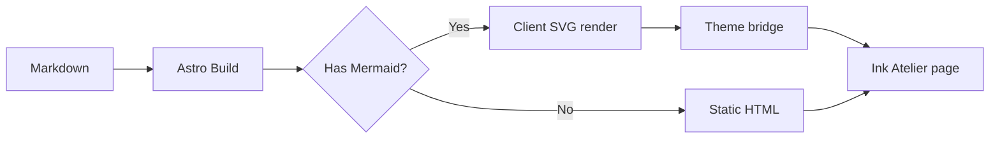
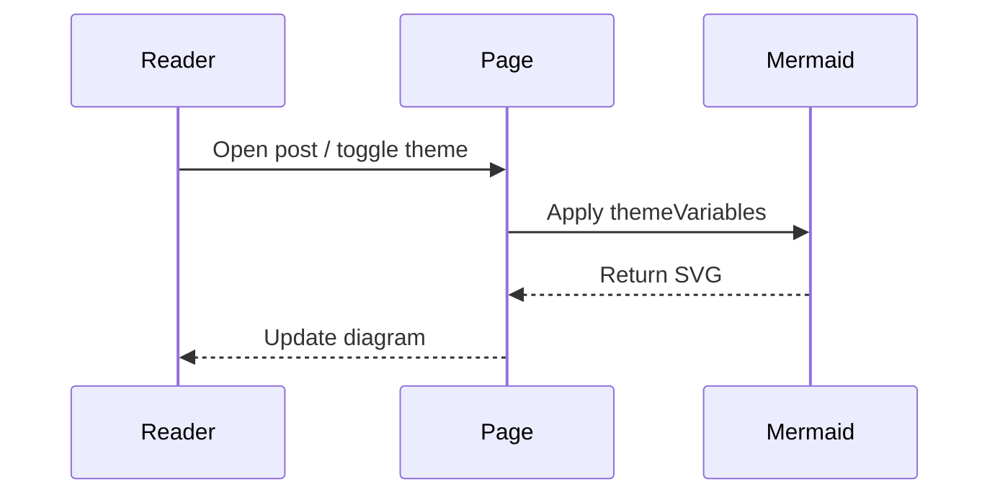

Diagrams as code stay easier to maintain than screenshots. Ink Atelier renders `mermaid` fences via `astro-mermaid`, themed with the jade/mist palette.

## Flowchart

## Sequence

## Usage

Use a `mermaid` fenced code block in Markdown or MDX. Toggling light/dark re-renders diagrams with the site tokens.
