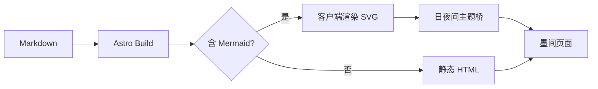
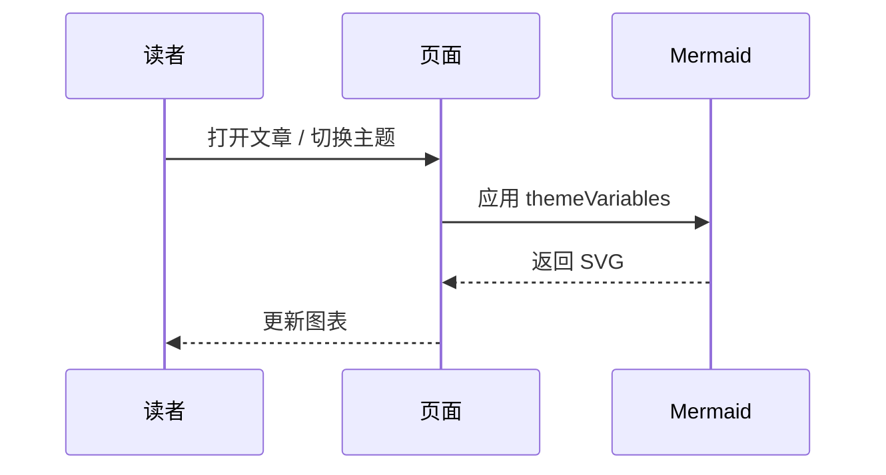

复杂关系用代码画出来，比截图更易维护。墨间通过 `astro-mermaid` 渲染 Mermaid 代码块，并用站点玉青绿令牌适配明暗主题。

## 流程图

```mermaid
flowchart LR
  A[Markdown] --> B[Astro Build]
  B --> C{含 Mermaid?}
  C -->|是| D[客户端渲染 SVG]
  C -->|否| E[静态 HTML]
  D --> F[日夜间主题桥]
  F --> G[墨间页面]
  E --> G
```

## 时序图

```mermaid
sequenceDiagram
  participant U as 读者
  participant P as 页面
  participant M as Mermaid
  U->>P: 打开文章 / 切换主题
  P->>M: 应用 themeVariables
  M-->>P: 返回 SVG
  P-->>U: 更新图表
```

## 写法

在 Markdown / MDX 中使用 `mermaid` 围栏代码块即可。切换顶栏日夜间时，图表会按墨间色板重新渲染。
