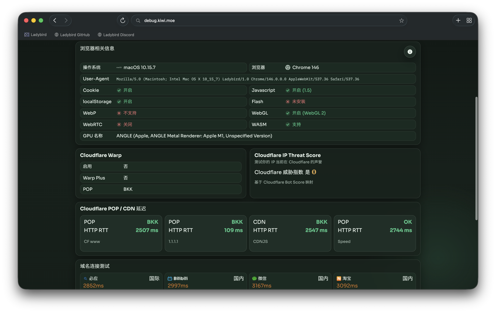

## 开篇

现在大家常用的浏览器，底层其实都跑在三个内核上：Chrome 用的 Blink、Safari 用的 WebKit，还有 Firefox 用的 Gecko。所以表面上你在挑浏览器，实际上换的都是同一套内核的外壳。

Ladybird 是另一个路子。它没用上面任何一个内核，而是把 HTML 解析、JavaScript 引擎、图形渲染、网络层全部自己实现了一遍。项目自己的介绍是：a truly independent web browser（真正独立的网页浏览器）。

这篇文章就记录我在 Mac 上做的事：从源码把 Ladybird 编译出来，把它跑起来，再验证它的引擎确实能正常渲染网页。

## 一、Ladybird 是什么

Ladybird 最早是 SerenityOS 项目里的一个浏览器。SerenityOS 是一个个人爱好者从零写起的操作系统，Ladybird 本来是它自带的图形界面浏览器，后来因为想做的事情太多，就单独分了出来，成了一个独立项目。

它的做法比较硬核，但说起来也简单：

- 按 Web 标准实现，但引擎全部是自己写的；
- 多进程架构：主界面进程、多个负责渲染的 WebContent 进程、图片解码进程、网络请求进程，彼此分开；
- 每个标签页有自己独立的、被隔离的渲染进程；
- 图片解码和网络连接都在单独的进程里完成，用来挡住恶意内容。

支撑这些的是一整套叫 "Lagom" 的自研库（Lagom 是瑞典语“刚刚好”的意思，也是这个项目“够用就好”的代码哲学）：LibWeb（渲染引擎）、LibJS（JavaScript 引擎）、LibWasm（WebAssembly）、LibGfx（2D 图形和图片解码）、LibIPC（进程间通信）、LibCore（事件循环和系统抽象）、LibHTTP、LibTLS、LibMedia、LibUnicode……

重点是，这些库没有一个是从现有的开源引擎 fork 出来的，每一层都是重新写的。这正是它和别的浏览器最不一样的地方。

项目目前是 pre\-alpha，官方明确说现在只适合开发者折腾，不是给普通人日常用的成品。所以对待它的态度应该是：来学习、来探索、来给 Web 的多样性投一票，项目距离真正替代主力浏览器还要很长的一段距离。

## 二、动手编译\*

Ladybird 官方提供了一个一键脚本 `Meta/ladybird.py`，把 vcpkg 依赖管理、CMake 配置、编译、运行全包了。但“一键”背后，是对耐心和网络的真实考验。下面这些记录来自我在 macOS 上的实际操作（Apple clang 21、CMake 4.4）。

### 2.1 先把工具链补齐

macOS 上要装的前置依赖比 Linux 少一些，因为 Xcode/clang 已经在了：

```bash
# 基础构建工具
brew install autoconf autoconf-archive automake ccache libtool nasm ninja pkg-config

# Rust 工具链（Ladybird 的部分组件用 Rust 写）
curl -sSf https://sh.rustup.rs | sh -s -- -y
export PATH="$HOME/.cargo/bin:$PATH"
```

另外需要 CMake ≥ 3.30 和支持 C\+\+23 的编译器——Apple clang 21 满足要求，所以不用额外装 LLVM。

### 2.2 vcpkg：74 个依赖

Ladybird 用 vcpkg 管第三方依赖。跑 `./Meta/ladybird.py build` 时，第一件事不是编译 Ladybird 自己，而是拉起 vcpkg，去构建 Skia（图形）、ffmpeg（媒体）、ICU（Unicode）、harfbuzz、openssl、curl……一长串重量级库。

我盯着日志看它逐个装，总共 74 个包，从源码编译并链接，花了大约 2.5 小时。真正的瓶颈不是 CPU，而是网络：有些源码包（比如 OpenGL 注册表、Skia 本身的镜像）体积很大，下载速度一度很慢。好在项目自己搞了个 asset cache 加速，多数包能命中缓存。

这一阶段的经验：耐心等完 vcpkg，后面就轻松了。而且 vcpkg 的结果会缓存，意味着如果配置阶段出错重来，不用再熬这 2.5 小时。

### 2.3 一个意料之中的坑：ninja 缺席

第一次配置时，vcpkg 全部装完，宿主工程的 CMake 配置却失败了：

```text
CMake Error: CMake was unable to find a build program corresponding to "Ninja".
CMAKE_MAKE_PROGRAM is not set.
```

原因有点微妙：vcpkg 自己会下载一份 ninja 来构建依赖，但宿主工程配置时需要的 ninja 得在 PATH 上。我当时没把 ninja 放进 PATH，就卡在这里。

修复很简单：

```bash
brew install ninja
```

然后重跑 `./Meta/ladybird.py build`。因为 vcpkg 已经缓存，这一轮只跑了大约 19 分钟真正的编译，最后 `EXIT_CODE=0`。

顺带一提，这个报错信息本身是个“红鲱鱼”（官方文档也这么提醒）。它看着像找不到 Ninja，本质几乎总是 vcpkg 依赖构建出了问题。这次确实是 PATH 的问题，不是 vcpkg 失败。

### 2.4 安装到哪里：/tmp

`ladybird.py install` 默认装到 `/usr/local`，那需要管理员权限——而脚本明确禁止用 root 跑（否则 Build 目录会被 root 占有）。既然我想把安装放到 `/tmp`，就直接指定了安装前缀：

```bash
cmake -S . -B Build/release -DCMAKE_INSTALL_PREFIX=/tmp/ladybird-install
cmake --install Build/release --prefix /tmp/ladybird-install
```

安装日志里会出现一大片 `install_name_tool: no LC_RPATH ...` 的提示，看着吓人，其实是安装后修正 rpath 时的非致命告警（某些 dylib 本来就没有对应的 rpath 项可删），最后 `EXIT_CODE=0`。

安装产物结构如下：

```text
/tmp/ladybird-install
├── bundle/Ladybird.app      # macOS AppKit 界面浏览器
├── bin/js                   # JavaScript REPL
├── bin/wasm                 # WebAssembly REPL
└── libexec/                 # 子进程：WebContent / WebWorker / Compositor / RequestServer / ImageDecoder
```

## 三、跑起来验证引擎

下面在终端中进行无头模式验证：直接验证引擎管线本身能不能正常工作。

Ladybird 自带无头（headless）模式，加上两个 REPL，刚好够用。

**1. JavaScript 引擎（LibJS）：**

```bash
echo 'console.log("hello from " + (1+2*3))' | ./bin/js
# 输出： "hello from 7"
```

表达式 `1+2*3` 被正确求值为 `7`，说明 LibJS 的词法、语法、求值链路是通的。

**2. WebAssembly 引擎（LibWasm）：**

```bash
./bin/wasm --version
# 输出： Version 1.0
```

**3. 完整渲染管线（LibWeb \+ 无头模式）：**

```bash
echo '<!doctype html><title>hi</title><h1>Hello Ladybird</h1>' > /tmp/test.html
./bin/Ladybird.app/Contents/MacOS/Ladybird --headless=text --disable-sandbox /tmp/test.html
# 输出（节选）： Hello Ladybird
```

它真的把一段 HTML 解析、布局、渲染，用纯文本形式吐出了 `&lt;h1&gt;` 的内容。这一行 `Hello Ladybird`，才是整个项目“活过来了”的真正证据——它意味着从 HTML 解析、CSS 盒模型到文本布局的整条流水线都在运转。

提示：无头日志里偶尔会冒出 `mach_msg failed` 之类的 macOS 沙箱提示，在显式 `--disable-sandbox` 下是无害的，不影响渲染结果。

## 四、实际用下来的体验



说实话，Ladybird 对网页的渲染效果超出了我的预期。我原本以为一个从零写的引擎，能打开几个简单页面就不错了，结果它在绝大多数网站上的表现都比较正常：哔哩哔哩的视频可以正常播放，但是中间会存在一些卡顿问题。然后弹幕字体的渲染和其他浏览器相比也比较奇怪。不过这都不是大问题。

日常刷的多数页面都没问题，排版正常、能交互、能看。我粗估下来，它能覆盖市面上 99.9% 的网页，普通上网基本够用。

当然也有几个明显的短板：

- 偶尔会有轻微的卡顿，不是每次都有，但碰到复杂页面会更明显；
- 字体渲染还有问题，某些页面看着不够顺眼，跟 Chrome、Safari 比有差距；
- 遇到特别吃图形的大页面会直接卡死。最典型的是原神官网，打开就彻底卡住，整个界面动不了。

但这些都不影响我对它的整体评价：作为一个还在 pre\-alpha 阶段的项目，能把网页渲染到这个程度，已经很超出预期了。

## 五、对这个项目的一点担心

用下来很惊喜，但我也忍不住替它捏把汗：这个项目能撑多久？

Ladybird 的运营方式比较特别——它主要靠社区赞助来维持。现在确实有一批人在捐钱、在贡献代码，但问题在于这种模式不太可持续。社区里其实也有同样的担忧：一旦现在的赞助资金到头，或者核心维护者精力跟不上，这个项目很可能就推不动了。

浏览器引擎是个无底洞，标准在变、网站在变、安全漏洞也在变，需要长期有人持续投入。靠爱发电和零散赞助，能不能熬过这一年又一年，是个真问题。

我不是唱衰，只是觉得这么一个有价值的项目，如果最后因为钱的问题停掉，会挺可惜的。希望它能找到更稳的 funding 来源并和推进可持续的商业化进程。

## 结语

编译 Ladybird 的过程说复杂也复杂：2.5 小时的依赖、一次 ninja 的小坑，最后是那行从无头渲染里跳出来的 `Hello Ladybird` 和正式的图形化界面应用。

它不会让你马上扔掉 Chrome。但它确实证明了：在 Blink、WebKit、Gecko 之外，还有人愿意从零把浏览器重写一遍。光是“存在这么一个选择”，对 Web 生态就是有意义的。

\*文章中编译过程由Agent自主完成，本文内容经过生成式人工智能润色。
